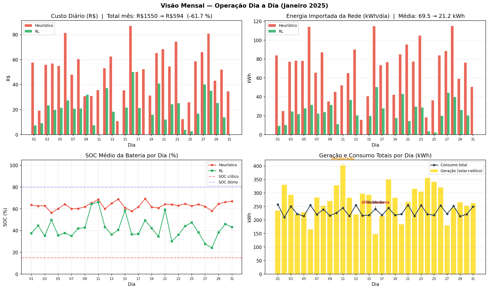
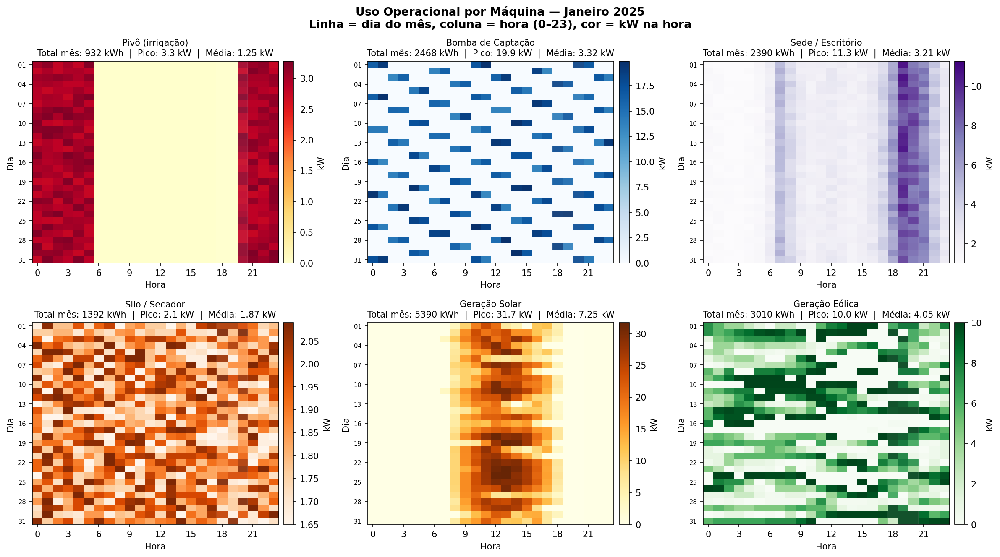
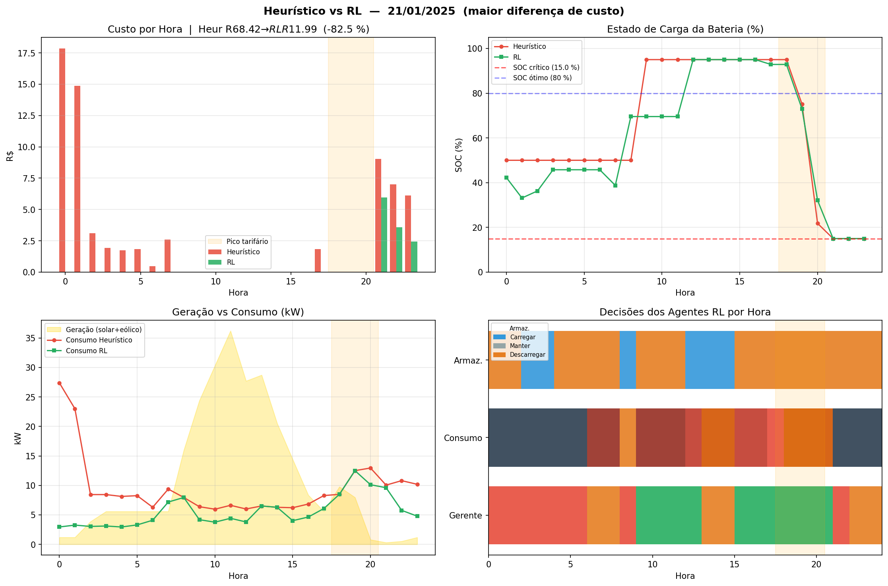
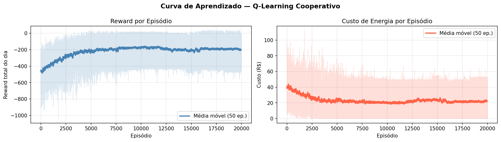

# SmartEnergy MAS — Gestão Energética com Multi-Agentes


Sistema Multi-Agentes (MAS) com **Q-Learning Cooperativo (Hysteretic)** focado na minimização de custos energéticos em uma fazenda de grãos. 

> **Contexto:** Trabalho de Conclusão de Curso (TCC) desenvolvido com dados reais da **Fazenda Buritis** (Luziânia, GO) referentes a Janeiro de 2025.

---

## 🚀 Resultados Finais
Após as otimizações de Hysteretic Q-Learning e rebalanceamento de rewards, o sistema atingiu:
*   **57.2% de economia** no custo diário médio.
*   **64.0% de redução** na dependência da rede elétrica.
*   **Zero violações** de segurança operacional (SOC e PCC).

---

## 📊 Dashboard de Resultados

O projeto agora conta com um dashboard unificado (Tkinter + Matplotlib) que permite visualizar o desempenho do mês completo:

### 1. Visão Mensal e Heatmaps

*Resumo diário de custos, importação de energia e estado da bateria.*


*Heatmaps mostrando o perfil de carga de cada equipamento ao longo do mês.*

### 2. Comparativo Diário e Aprendizado

*Análise detalhada do dia de maior economia (28/01/2025).*


*Evolução do Reward e Custo durante os 20.000 episódios de treino.*

---

## 🛠️ Otimizações Aplicadas

### 1. Hysteretic Q-Learning
Para resolver o problema de não-estacionariedade em sistemas multi-agente, implementamos o algoritmo **Hysteretic Q-Learning**.
*   **Taxa Otimista (α=0.1):** Aprende rápido quando o resultado é melhor que o esperado.
*   **Taxa Pessimista (β=0.01):** Esquece devagar bons resultados quando ocorrem erros de coordenação.

### 2. Rebalanceamento do Reward
Ajustamos os pesos para que o **custo financeiro** fosse o sinal dominante da função de recompensa, evitando que os agentes "gamificassem" o SOC da bateria em detrimento da economia real.

| Componente | Peso Novo | Impacto |
| :--- | :--- | :--- |
| **Custo Diário** | **8.0** | Sinal dominante ✅ |
| **Bateria (SOC)** | 15.0 | Barreira de segurança |
| **Excedente Solar** | 0.5 | Incentivo à exportação |

---

## 📂 Estrutura do Projeto

```text
smarty_energy_RL/
├── main.py                # Ponto de entrada (executa pipeline + dashboard)
├── requirements.txt       # Dependências
├── src/
│   └── smarty_energy/
│       ├── environment.py # Simulador da Fazenda
│       ├── agents.py      # Agentes Q-Learning (Hysteretic)
│       ├── config.py      # Hiperparâmetros e Pesos
│       ├── dashboard.py   # Interface visual Tkinter
│       └── visualization.py # Lógica de geração de gráficos
└── outputs/               # Gráficos e modelos treinados
```

---

## ⚙️ Como Executar

1. Instale as dependências:
   ```bash
   pip install -r requirements.txt
   ```
2. Execute o sistema completo:
   ```bash
   python main.py
   ```
3. O sistema irá treinar por 20.000 episódios e abrirá o dashboard automaticamente ao final.
