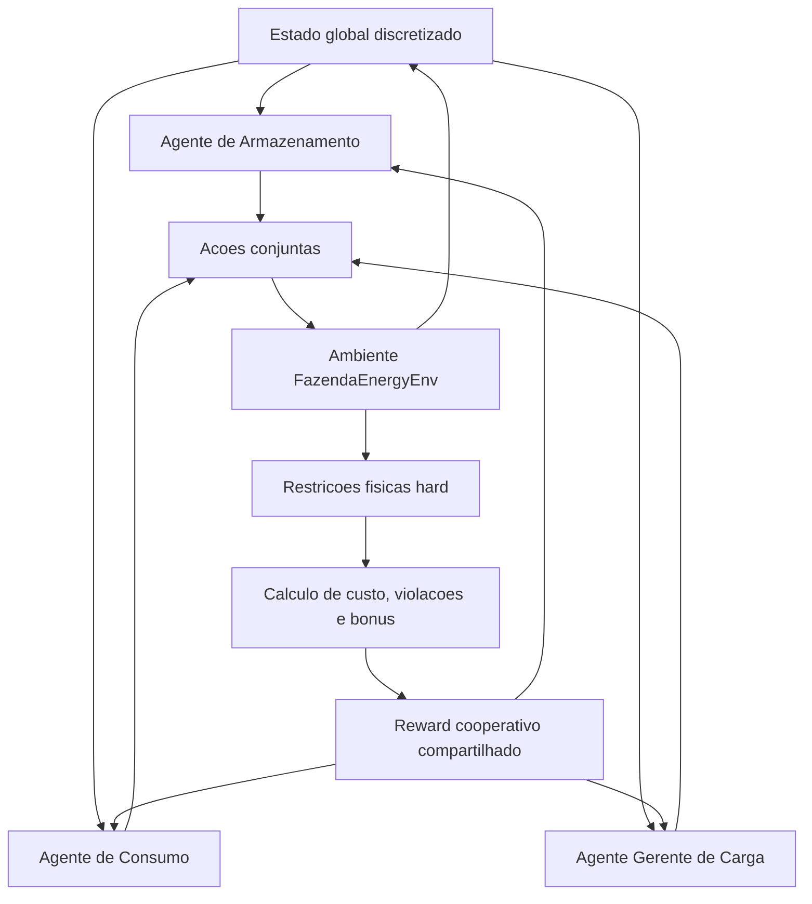

# Arquitetura de Agentes para a Dissertacao

Este documento compila uma descricao interpretativa da arquitetura de agentes do projeto SmartEnergy MAS, com foco em como apresenta-la em uma dissertacao. A leitura tecnica parte da implementacao em `FazendaEnergyEnv`, `AgenteQL`, `IQLSystem`, do loop de treinamento IQL e da camada MCP.

## Visao Geral

A arquitetura interna do projeto pode ser descrita como um **Sistema Multiagente Cooperativo baseado em Hysteretic Independent Q-Learning**, aplicado ao despacho energetico horario de uma fazenda.

A formulacao mais precisa e:

> aprendizado descentralizado por agente, coordenacao indireta por recompensa global compartilhada e execucao conjunta em um ambiente fisico restritivo.

Os agentes nao se comunicam diretamente nem negociam entre si. A coordenacao surge porque todos observam o mesmo estado discretizado do ambiente e recebem o mesmo sinal de recompensa cooperativo.

## Agentes Do Sistema

O sistema e dividido em tres agentes de controle, cada um com uma responsabilidade operacional especifica e uma Q-table propria.

| Agente | Funcao | Decisao |
|---|---|---|
| Armazenamento | Gerenciar bateria | carregar, manter ou descarregar |
| Consumo | Atuar sobre cargas interruptiveis | mascara de corte de cargas |
| Gerente de carga | Definir teto operacional | conservador, moderado ou liberal |

Essa separacao permite decompor o problema de gestao energetica em subdecisoes funcionais. Apesar disso, o objetivo continua global: reduzir custo energetico e respeitar restricoes operacionais da fazenda.

## Ausencia De Um Agente Central Decisorio

No projeto, nao ha um **agente central** que aprende ou escolhe as acoes dos demais. A arquitetura nao e centralizada no sentido de haver um controlador unico responsavel por tomar todas as decisoes.

O que existe e um **ambiente central**, implementado como `FazendaEnergyEnv`. Ele e responsavel por:

- manter o estado fisico da fazenda;
- calcular o estado observado pelos agentes;
- discretizar esse estado para uso nas Q-tables;
- aplicar as acoes dos tres agentes;
- impor restricoes fisicas hard;
- calcular o reward cooperativo;
- devolver o proximo estado.

Assim, a relacao conceitual pode ser resumida como:

> os agentes decidem; o ambiente governa a dinamica.

Portanto, a centralizacao esta na modelagem do ambiente, na geracao do estado e no calculo da recompensa, nao na tomada de decisao.

## Geracao Dos Estados

Os agentes nao geram os estados que devem seguir. Eles recebem do ambiente uma representacao discretizada da condicao operacional da fazenda.

O estado continuo/descritivo e montado pelo ambiente a partir de informacoes como:

- hora do dia;
- estado de carga da bateria, ou SOC;
- geracao solar e eolica;
- tarifa horaria;
- indice de estresse financeiro;
- energia acumulada do secador;
- horas de operacao da bomba;
- saldo de creditos energeticos.

Em seguida, esse estado e convertido em uma tupla discreta usada como chave das Q-tables:

```text
(bucket_hora, bucket_soc, bucket_solar, bucket_stress, meta_secador, bucket_bomba)
```

A sequencia de estados ao longo da simulacao e produzida pela combinacao de cinco fatores:

1. dados reais horarios da fazenda;
2. tarifa horaria;
3. estado interno acumulado, como SOC, secador e bomba;
4. acoes escolhidas pelos agentes;
5. restricoes fisicas aplicadas pelo ambiente.

Desse modo, o sistema pode ser caracterizado como uma arquitetura de **decisao multiagente descentralizada com ambiente centralizado**.

## Papel Do Ambiente

O ambiente `FazendaEnergyEnv` e o nucleo da simulacao. A cada passo horario, ele recebe as tres acoes escolhidas pelos agentes e calcula seus efeitos sobre a operacao da fazenda.

Ele tambem garante que as decisoes aprendidas nao violem regras fisicas ou operacionais. Entre essas restricoes estao:

- limite minimo e maximo de SOC da bateria;
- eficiencia de carga e descarga;
- limite de throughput diario da bateria;
- limite de conexao com a rede, ou PCC;
- cronogramas obrigatorios de determinadas cargas;
- teto de consumo horario;
- regras de operacao para pivo, bomba, secador, sede e silo.

Um ponto metodologico importante e que o espaco nominal de acoes do agente de consumo pode ser maior que o controle efetivo permitido pelo ambiente. Em alguns casos, restricoes hard neutralizam ou sobrescrevem parte da decisao do agente. Na dissertacao, isso deve ser descrito explicitamente:

> o espaco nominal de acoes do agente de consumo e maior que o controle efetivo permitido pelo ambiente, pois restricoes operacionais tem precedencia sobre decisoes aprendidas.

Essa observacao fortalece a metodologia, pois mostra que a politica aprendida e avaliada dentro de limites fisicos realistas.

## Reward Cooperativo

Todos os agentes recebem o mesmo reward calculado pelo ambiente. Esse reward combina custos, penalidades e bonus relacionados a operacao energetica.

Em termos conceituais, ele penaliza:

- custo de energia da rede;
- estresse financeiro;
- SOC critico;
- consumo proximo ou acima do teto;
- violacao de PCC;
- corte de producao;
- nao atendimento de metas operacionais;
- uso de cargas em horario de pico.

E recompensa:

- carregamento da bateria com excedente renovavel;
- uso de excedente energetico;
- manutencao do SOC em faixa adequada;
- operacao de cargas em momentos favoraveis de geracao solar.

Esse desenho caracteriza uma coordenacao indireta: cada agente aprende individualmente, mas todos sao avaliados por um objetivo global comum.

## Hysteretic Independent Q-Learning

A arquitetura utiliza **Independent Q-Learning**, pois cada agente possui sua propria Q-table e atualiza sua politica individualmente. No entanto, como todos aprendem simultaneamente em um mesmo ambiente, surge o problema de nao estacionariedade: para um agente, o ambiente parece mudar porque os outros agentes tambem estao aprendendo.

Para mitigar esse efeito, o projeto utiliza **Hysteretic Q-Learning**, com duas taxas de aprendizado:

- `alpha`: taxa otimista, usada quando o erro temporal e positivo;
- `beta`: taxa pessimista, menor, usada quando o erro temporal e negativo.

Com isso, os agentes aprendem rapidamente quando uma coordenacao produz resultado melhor que o esperado, mas reduzem lentamente o valor de comportamentos promissores quando ocorrem falhas temporarias de coordenacao.

## Papel Do IQLSystem E Do Loop De Treino

Embora nao haja agente central decisorio, existe um componente de orquestracao dos agentes. Esse papel aparece no `IQLSystem` e no loop de treinamento.

Esse orquestrador:

- instancia os tres agentes;
- solicita uma acao de cada agente;
- envia a acao conjunta ao ambiente;
- recebe reward e proximo estado;
- propaga o mesmo reward para as tres atualizacoes Q-Learning;
- aplica o decaimento de epsilon;
- preserva historico de treinamento e metricas.

Portanto, o orquestrador organiza a execucao do aprendizado, mas nao substitui os agentes na tomada de decisao.

## Papel Da Camada MCP

A camada MCP deve ser apresentada separadamente do nucleo multiagente. Ela nao e o sistema de agentes em si, mas uma camada de exposicao, auditoria e operacao externa.

O servidor MCP expoe ferramentas para:

- configurar hiperparametros dos agentes;
- alterar pesos do reward;
- treinar agentes;
- avaliar politicas;
- comparar estrategias;
- consultar Q-tables;
- gerar relatorios de saude;
- executar episodios e traces horarios.

Assim, a camada MCP permite que um dashboard ou um modelo de linguagem atue como cliente externo do sistema, sem duplicar a logica fisica do ambiente. O servidor mantem dataset, Q-tables e metricas; o cliente apenas invoca ferramentas e renderiza os resultados.

Uma descricao adequada seria:

> Alem do pipeline offline, o projeto inclui uma camada baseada no Model Context Protocol, responsavel por expor o motor multiagente como um conjunto de ferramentas invocaveis externamente. Essa camada mantem o dataset, as Q-tables e os rastreadores de metricas no servidor, permitindo que clientes externos, como dashboards ou modelos de linguagem, realizem treinamento, avaliacao e auditoria da politica aprendida sem duplicar a logica fisica do ambiente.

## Como Nomear A Arquitetura

Algumas formulacoes adequadas para a dissertacao sao:

1. Sistema Multiagente Cooperativo com Hysteretic Independent Q-Learning.
2. Arquitetura MAS-IQL Histeretica para gestao energetica agricola.
3. Controle multiagente tabular com recompensa global compartilhada.
4. Aprendizado descentralizado com estado e recompensa global fornecidos por ambiente compartilhado.
5. Decisao multiagente descentralizada com ambiente centralizado.

A formulacao mais completa para uma secao de metodologia e:

> Arquitetura Multiagente Cooperativa baseada em Hysteretic Independent Q-Learning.

## Texto Sugerido Para A Dissertacao

> A arquitetura proposta consiste em um Sistema Multiagente Cooperativo para gestao energetica agricola, composto por tres agentes de aprendizado por reforco tabular: um agente de armazenamento, responsavel pelo despacho da bateria; um agente de consumo, responsavel pela modulacao de cargas controlaveis; e um agente gerente, responsavel pela definicao do teto de consumo horario. Cada agente mantem sua propria tabela de valores Q, caracterizando uma abordagem de Independent Q-Learning. Apesar da independencia das politicas, os agentes compartilham o mesmo estado global discretizado e recebem uma recompensa cooperativa comum, calculada a partir do custo energetico, penalidades operacionais, violacoes fisicas e bonus associados ao uso eficiente de geracao renovavel.

> A arquitetura nao possui um agente central decisorio. A coordenacao ocorre por meio de um ambiente compartilhado, responsavel por gerar a representacao de estado, aplicar as acoes conjuntas dos agentes e calcular uma recompensa global comum. O ambiente atua como nucleo de simulacao e validacao fisica, enquanto os agentes mantem politicas independentes. Assim, a centralizacao esta na modelagem do ambiente e do sinal de recompensa, nao na tomada de decisao.

> O ambiente de simulacao representa a operacao horaria da fazenda, incluindo geracao solar e eolica, bateria, cargas produtivas, cargas fixas, tarifa horaria e limite de conexao com a rede. A cada passo temporal, os tres agentes selecionam simultaneamente suas acoes, que sao aplicadas ao ambiente sob restricoes fisicas rigidas. Essas restricoes tem prioridade sobre a acao dos agentes, garantindo que a politica aprendida permaneca compativel com limites operacionais como SOC minimo, capacidade da bateria, limite de PCC e cronogramas obrigatorios de determinados equipamentos.

> Para mitigar a nao estacionariedade tipica de sistemas multiagente, o treinamento utiliza Q-Learning histeretico. Nessa estrategia, atualizacoes positivas do erro temporal utilizam uma taxa de aprendizado maior, enquanto atualizacoes negativas utilizam uma taxa menor. Com isso, os agentes preservam comportamentos cooperativos promissores diante de falhas temporarias de coordenacao, reduzindo oscilacoes no aprendizado conjunto.

## Diagrama Conceitual



## Resumo Critico

A arquitetura e coerente para uma dissertacao porque combina:

- decomposicao funcional do problema em tres agentes especializados;
- aprendizado independente com objetivo global comum;
- ambiente com restricoes fisicas explicitas;
- reward cooperativo alinhado a minimizacao de custo e preservacao operacional;
- mecanismo histeretico para reduzir instabilidade multiagente;
- baselines comparativos, como sem agente, heuristico e RL;
- camada MCP como infraestrutura de avaliacao, auditoria e possivel ajuste assistido por LLM.

Deve-se evitar descreve-la como uma arquitetura de agentes autonomos que negociam entre si. A formulacao mais precisa e:

> agentes independentes, sem comunicacao direta, coordenados implicitamente por uma recompensa cooperativa comum e por um ambiente compartilhado.