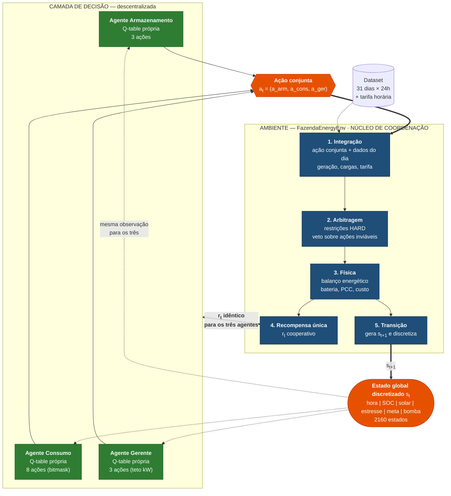
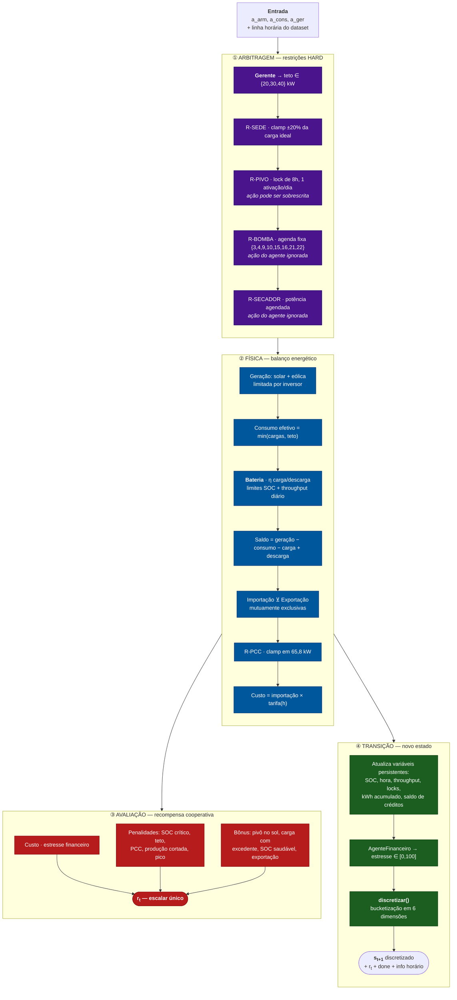
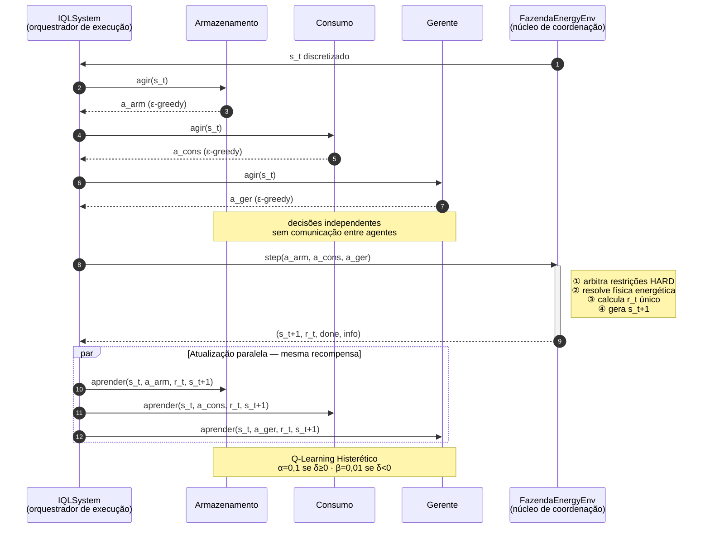
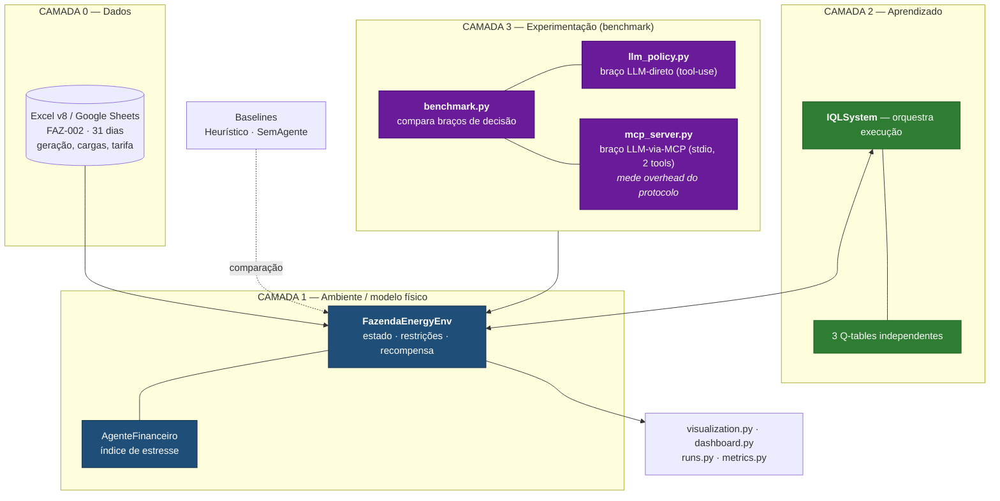
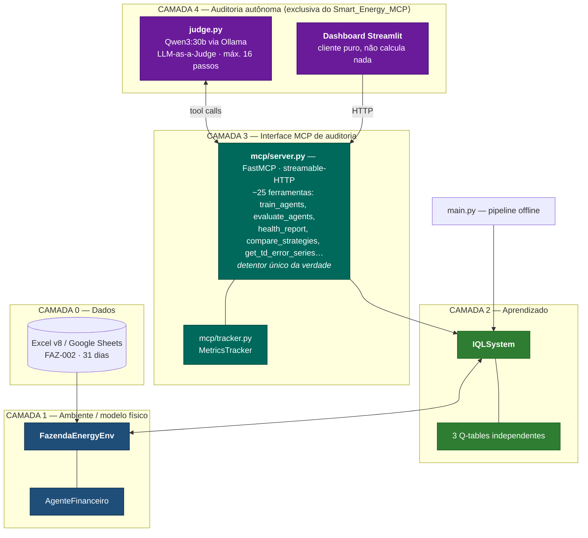

# Arquitetura de Agentes — Compilado para Dissertação

> Documento consolidado descrevendo a arquitetura multiagente dos projetos
> **Smart_Energy** e **Smart_Energy_MCP**, com diagramas, formalização e
> orientações de redação acadêmica.
>
> Última revisão: 2026-08-21

---

## Sumário

1. [Escopo: dois projetos, dois papéis](#1-escopo-dois-projetos-dois-papéis)
2. [Desambiguação do termo "agente"](#2-desambiguação-do-termo-agente)
3. [Arquitetura do sistema multiagente (núcleo)](#3-arquitetura-do-sistema-multiagente-núcleo)
4. [O ambiente como núcleo de coordenação](#4-o-ambiente-como-núcleo-de-coordenação)
5. [Diagramas](#5-diagramas)
6. [Camada MCP e auditoria por LLM](#6-camada-mcp-e-auditoria-por-llm)
7. [Resultados empíricos](#7-resultados-empíricos)
8. [Roteiro de redação da dissertação](#8-roteiro-de-redação-da-dissertação)
9. [Terminologia recomendada](#9-terminologia-recomendada)
10. [Limitações a declarar](#10-limitações-a-declarar)
11. [Referências cruzadas de código](#11-referências-cruzadas-de-código)

---

## 1. Escopo: dois projetos, dois papéis

**Correção importante em relação a análises anteriores.** Os dois repositórios
compartilham o mesmo núcleo de RL, mas **não** possuem a mesma camada de LLM.

| Componente | `Smart_Energy` | `Smart_Energy_MCP` |
|---|:--:|:--:|
| Núcleo IQL (`agents.py`, `environment.py`, `training.py`) | ✅ | ✅ |
| Avaliação e métricas (`evaluation.py`, `metrics.py`) | ✅ | ✅ |
| `llm_policy.py` — política LLM direta (tool-use) | ✅ | ✅ |
| `mcp_server.py` — servidor MCP **de benchmark** (stdio, 2 ferramentas) | ✅ | ✅ |
| Pacote `mcp/` — servidor de **auditoria** (~25 ferramentas, HTTP) | ❌ | ✅ |
| `mcp/dashboard/` — dashboard Streamlit cliente | ❌ | ✅ |
| `mcp/tracker.py` — `MetricsTracker` | ❌ | ✅ |
| **`judge.py` — LLM-as-a-Judge autônomo** | ❌ | ✅ |

### 1.1 Consequências para a dissertação

- **`Smart_Energy` é o projeto-base**: contribuição = sistema multiagente
  cooperativo com Q-Learning Histerético e camada de restrições físicas.
- **`Smart_Energy_MCP` é a extensão**: contribuição adicional = camada de
  observabilidade e auditoria autônoma via Model Context Protocol.
- A camada Judge **não deve** ser descrita como parte da arquitetura do
  `Smart_Energy`. Trate-a como capítulo/seção separada, apresentada como
  evolução metodológica.

### 1.2 Os dois usos de MCP não se confundem

Este é um ponto que a banca pode explorar. Existem **dois servidores MCP
distintos**, com propósitos opostos:

| | `mcp_server.py` (ambos os projetos) | `mcp/server.py` (só no `_MCP`) |
|---|---|---|
| **Propósito** | Medir o *overhead do protocolo* MCP | Auditar e operar o sistema |
| **Transporte** | stdio | streamable-HTTP (`127.0.0.1:8000`) |
| **Ferramentas** | 2 (`estado_atual`, `decidir_controle`) | ~25 |
| **Papel do LLM** | LLM **decide ações** de controle (braço experimental) | LLM **avalia** o sistema, não decide controle |
| **Usado em** | `benchmark.py` — comparação LLM-direto × LLM-via-MCP | `judge.py` e dashboard |

O primeiro isola `overhead_MCP ≈ latência(via-MCP) − latência(direto)`; o
segundo expõe o sistema para inspeção externa. Deixe isso explícito no texto.

---

## 2. Desambiguação do termo "agente"

O termo aparece em três sentidos no código. Separe-os na dissertação:

| Sentido | Entidade | Onde |
|---|---|---|
| **Agente de RL** (sentido forte) | Armazenamento, Consumo, Gerente de Carga | `agents.py` |
| **Componente auxiliar** (sentido fraco) | `AgenteFinanceiro` — calcula índice de estresse; não aprende nem decide | `agents.py` |
| **Agente LLM** (sentido de software autônomo) | `judge.py` — cliente MCP com laço de raciocínio | só `Smart_Energy_MCP` |

Apenas os três primeiros constituem o **Sistema Multiagente (SMA)** propriamente
dito.

---

## 3. Arquitetura do sistema multiagente (núcleo)

### 3.1 Classificação formal

**Sistema Multiagente Cooperativo com aprendizado descentralizado e ambiente
centralizado**, modelado como Dec-POMDP com recompensa compartilhada e resolvido
por *Independent Q-Learning* (IQL) tabular com atualização histerética.

Referências sugeridas:

- Tan, M. (1993). *Multi-agent reinforcement learning: Independent vs.
  cooperative agents.* — origem do IQL.
- Matignon, L., Laurent, G. J., Le Fort-Piat, N. (2007). *Hysteretic Q-learning:
  an algorithm for decentralized reinforcement learning in cooperative
  multi-agent teams.* — base do α/β assimétrico.
- Oliehoek, F. A., Amato, C. (2016). *A Concise Introduction to Decentralized
  POMDPs.* — formalização Dec-POMDP.
- Alshiekh, M. et al. (2018). *Safe Reinforcement Learning via Shielding.* —
  base conceitual da camada de restrições HARD.

### 3.2 Formalização

Tupla $\langle N, S, \{A_i\}_{i=1}^{N}, T, R, \gamma \rangle$:

- $N = 3$ agentes;
- $|S| = 2160$ estados discretos;
- $A_1 = \{0,1,2\}$ (armazenamento), $|A_2| = 8$ (consumo, bitmask),
  $A_3 = \{0,1,2\}$ (gerente);
- $T$ — transição determinística dada pelo modelo físico do ambiente;
- $R$ — **recompensa escalar única, comum aos três agentes**;
- $\gamma = 0{,}98$.

O espaço de ação conjunto teórico é $|A| = 3 \times 8 \times 3 = 72$. A
fatoração em políticas independentes ($3 + 8 + 3 = 14$ valores-Q por estado, em
vez de 72) é justamente o que torna o problema tratável por tabela.

### 3.3 Os três agentes

Definidos em `construir_agentes()` — `src/smarty_energy/agents.py`.

| Agente | Responsabilidade | Ações |
|---|---|---|
| **Armazenamento** | Despacho da bateria | `0` carregar · `1` manter · `2` descarregar |
| **Consumo** | Corte de cargas interruptíveis | máscara de 3 bits (pivô, bomba, secador) |
| **Gerente de Carga** | Teto horário de consumo | `0` 20 kW · `1` 30 kW · `2` 40 kW |

Cada agente mantém **sua própria Q-table** (`defaultdict` com inicialização
preguiçosa), caracterizando IQL.

### 3.4 Espaço de estados

Vetor discretizado de 6 dimensões — $4 \times 10 \times 3 \times 3 \times 2 \times 3 = 2160$:

| Dimensão | Buckets | Faixas |
|---|:--:|---|
| `bucket_hora` | 4 | 0–5 / 6–11 / 12–17 / 18–23 h |
| `bucket_soc` | 10 | decis de 0 a 100 % |
| `bucket_solar` | 3 | < 5 kW / 5–15 kW / > 15 kW |
| `bucket_stress` | 3 | < 30 / 30–70 / > 70 (índice financeiro) |
| `meta_secador` | 2 | meta diária atingida ou não |
| `bucket_bomba` | 3 | < 3 h / 3–6 h / ≥ 6 h de operação |

### 3.5 Aprendizado: Q-Learning Histerético

$$
\delta_t = r_t + \gamma \max_{a'} Q_i(s_{t+1}, a') - Q_i(s_t, a_t)
$$

$$
Q_i(s_t,a_t) \leftarrow Q_i(s_t,a_t) +
\begin{cases}
\alpha\,\delta_t & \text{se } \delta_t \geq 0 \quad (\alpha = 0{,}10) \\[4pt]
\beta\,\delta_t  & \text{se } \delta_t < 0 \quad (\beta = 0{,}01)
\end{cases}
$$

com $\beta \ll \alpha$.

**Justificativa teórica.** Em sistemas multiagente o ambiente percebido por um
agente é **não-estacionário**, pois os demais também alteram suas políticas. Um
TD-error negativo pode indicar tanto uma decisão ruim quanto uma falha
transitória de coordenação alheia. A taxa pessimista $\beta$ faz o agente
"esquecer devagar", preservando políticas cooperativas já conquistadas.

Hiperparâmetros (`config.py`): $\gamma = 0{,}98$, $\varepsilon: 1{,}0 \to 0{,}01$,
decaimento $0{,}99993$ calibrado para 100 000 episódios.

### 3.6 Mecanismo de coordenação

**Coordenação implícita, mediada pelo ambiente.** Não há:

- comunicação agente-a-agente;
- negociação ou protocolo de mensagens;
- agente supervisor com poder de substituir decisões;
- grafo de orquestração (não se usa LangGraph, CrewAI ou AutoGen).

O acoplamento é inteiramente induzido por dois canais: o **estado global
compartilhado** e a **recompensa cooperativa única**.

### 3.7 Baselines de comparação

| Baseline | Descrição |
|---|---|
| `SemAgente` | Bateria inerte, teto liberal, pivô em horário ingênuo (16–23 h, cruza o pico) |
| `AgentesHeuristicos` | Três agentes baseados em regras, reagindo ao índice de estresse |
| `IQL` | Sistema proposto |

---

## 4. O ambiente como núcleo de coordenação

`FazendaEnergyEnv` (`src/smarty_energy/environment.py`) concentra toda a
integração informacional. Seu método `step()` executa quatro camadas em sequência.

### ① Camada de arbitragem — restrições HARD

As ações dos agentes são **propostas**, não comandos. O ambiente exerce veto:

| Restrição | Efeito |
|---|---|
| **R-SEDE** | Carga da sede limitada a ±20 % do ideal; eco-mode reduz 20 % sob estresse ≥ 70 |
| **R-PIVO** | Bloqueio de 8 h consecutivas, **uma única ativação por dia** |
| **R-BOMBA** | Agenda fixa `{3,4,9,10,15,16,21,22}` — **ação do agente ignorada** |
| **R-SECADOR** | Potência agendada pela base — **ação do agente ignorada** |
| **R-PCC** | Importação e exportação limitadas a 65,8 kW |
| **R-BAT** | Limites de SOC, eficiências $\eta_c/\eta_d$ e teto de throughput diário |

### ② Camada física — balanço energético

```
geração  = min(solar, inversor_max) + min(eólica, nominal)
consumo  = min(cargas_efetivas, teto_do_gerente)
saldo    = geração − consumo − carga_bateria + descarga_útil
importação ⊻ exportação   (mutuamente exclusivas)
custo    = importação × tarifa(hora)
```

### ③ Camada de avaliação — recompensa cooperativa

$$
r_t = -\,w_{c}\,C_t \;-\; w_{s}\,\frac{\sigma_t}{10}
\;-\; \sum_k p_k \,\mathbb{1}[v_k] \;+\; \sum_j b_j
$$

Componentes negativos: custo de rede (peso dominante), estresse financeiro,
SOC crítico, teto excedido, violação de PCC, produção cortada, pivô e secador
em horário de pico.
Componentes positivos: pivô em janela solar forte, secador com excedente, carga
da bateria com excedente, exportação valorada pela tarifa, SOC saudável
(30 % < SOC < 80 %).

**Histórico de rebalanceamento.** Na versão inicial os pesos permitiam que os
agentes explorassem manipulação de SOC. Na versão atual o custo passou a ter
peso dominante e a penalidade de SOC funciona como piso de segurança —
resultando em ganho adicional de ~40 % na redução de custo.

### ④ Camada de transição — geração do novo estado

1. Atualiza variáveis persistentes: SOC, hora, throughput diário, locks do
   pivô, kWh acumulado do secador, saldo de créditos solares.
2. `AgenteFinanceiro` recalcula o índice de estresse (0–100).
3. `discretizar()` bucketiza o estado contínuo nas 6 dimensões.
4. Retorna `(s_{t+1}, r_t, done, info)`.

**Propagação de SOC.** O estado de carga ao fim do dia $t$ é a condição inicial
do dia $t+1$, tanto no treino quanto na avaliação — reproduzindo a continuidade
física real.

---

## 5. Diagramas

### 5.1 Visão geral da arquitetura



> **Legenda.** Setas tracejadas = fluxo de informação (observação e recompensa);
> setas cheias = fluxo de controle. Não há seta entre agentes: a coordenação é
> integralmente mediada pelo ambiente.

### 5.2 Interior do núcleo de coordenação



### 5.3 Sequência de um timestep (1 hora)



### 5.4 Camadas de software — `Smart_Energy` (projeto-base)

**Sem camada Judge.** O uso de LLM aqui é exclusivamente experimental, dentro do
benchmark de trade-offs.



### 5.5 Camadas de software — `Smart_Energy_MCP` (extensão)

Aqui, e **somente aqui**, existe a camada de auditoria autônoma.



---

## 6. Camada MCP e auditoria por LLM

> ⚠️ **Escopo: exclusivo do `Smart_Energy_MCP`.** Não descrever como parte da
> arquitetura do `Smart_Energy`.

### 6.1 Servidor de auditoria

`src/smarty_energy/mcp/server.py` — servidor **FastMCP**, transporte
*streamable-HTTP* em `127.0.0.1:8000`, expondo aproximadamente 25 ferramentas.

| Categoria | Ferramentas |
|---|---|
| Configuração | `configure_agents`, `configure_reward_weights` |
| Treino / avaliação | `train_agents`, `evaluate_agents`, `compare_strategies`, `run_episode` |
| Diagnóstico | `health_report`, `get_learning_curve`, `get_td_error_series`, `get_qtables_info`, `get_eval_metrics`, `get_hourly_violations`, `get_peak_offpeak_stats`, `get_stats_por_cenario` |
| Dataset / cenários | `identify_scenarios`, `get_dataset_info`, `select_day`, `describe_schema` |
| Estado / ambiente | `get_current_state`, `get_observation`, `step_environment`, `get_actions`, `reset_environment` |
| Persistência | `save_qtables`, `load_qtables` |

**Princípio arquitetural.** O servidor é o **detentor único da verdade**:
dataset (`DIAS`, `TARIFA_24H`), Q-tables (`IQLSystem`) e `MetricsTracker`. O
dashboard Streamlit é cliente puro — apenas renderiza payloads, **não calcula
métrica alguma**. Isso elimina divergência entre o que se treina e o que se
reporta.

### 6.2 LLM-as-a-Judge

`judge.py` — cliente MCP autônomo:

```
Qwen3:30b (Ollama, endpoint OpenAI-compatível :11434/v1)
        │
        ├── conecta ao servidor MCP (:8000/mcp)
        │
        └── laço autônomo (máx. 16 passos):
              1. health_report()          → veredito consolidado
              2. decide: treinar mais? reajustar pesos? aprovar?
              3. executa ferramenta correspondente
              4. ao concluir, emite veredito em linguagem natural (PT-BR)
```

Variáveis de ambiente: `OLLAMA_BASE_URL`, `OLLAMA_API_KEY`, `JUDGE_MODEL`,
`MCP_SERVER_URL`, `JUDGE_MAX_STEPS`.

**Característica metodológica central.** O LLM **não gera números**. Todo dado
quantitativo provém de chamadas de ferramenta; o modelo apenas interpreta e
emite juízo. Isso constitui *grounding* verificável e é o argumento a usar
contra a crítica de alucinação.

### 6.3 Estrutura do `health_report()`

Payload consolidado com: informação do dataset; por agente — estados visitados,
cobertura percentual, número de updates, ε corrente e estatísticas recentes de
TD-error; resumo de treino com melhor episódio e verificação de estabilidade;
comparação contra os três baselines; lista de alertas heurísticos; e flag
indicando se os pesos de recompensa foram alterados em runtime.

---

## 7. Resultados empíricos

Execução canônica: 100 000 episódios, avaliação sobre 31 dias com propagação de SOC.

| Métrica | SemAgente | Heurístico | **IQL** | Ganho |
|---|--:|--:|--:|--:|
| Custo médio diário (R$) | 106,90 | 103,35 | **63,25** | **−40,8 %** |
| Importação média (kWh) | 154,9 | — | **92,6** | **−40,2 %** |
| Violações de PCC (h) | — | — | **0** | — |
| Violações de SOC (h/dia) | — | — | **0,032** | ~1 h em 31 dias |

**Convergência.** TD-error médio decai de ~2,0 para ~0,3 por volta do episódio
50 000; cobertura de estados ~40 % dos 2160; ε decai de 1,0 a 0,01.

**Cobertura de testes.** 104 testes no `Smart_Energy` (balanço energético,
restrições HARD, convergência) e 47 no `Smart_Energy_MCP` (ferramentas, tracker,
fixtures offline). Nenhum depende de rede.

**Artefatos versionados.** Cada execução gera `outputs/runs/<run_id>/` com
`meta.json`, as três Q-tables serializadas, `historico_treino.json` e
`resultados_eval.json`.

---

## 8. Roteiro de redação da dissertação

| Seção | Conteúdo | Fonte |
|---|---|---|
| **4.1** Classificação da arquitetura | SMA cooperativo, Dec-POMDP, IQL | §3.1 |
| **4.2** Formalização | tupla, espaços de estado e ação, fatoração | §3.2–3.4 |
| **4.3** Mecanismo de coordenação | coordenação implícita por recompensa | §3.6 |
| **4.4** Não-estacionariedade | Q-Learning Histerético, α/β | §3.5 |
| **4.5** Camada de restrições | *safe RL* / *action shielding* | §4 ① |
| **4.6** Função de recompensa | componentes, rebalanceamento | §4 ③ |
| **4.7** Protocolo experimental | baselines, propagação de SOC, métricas | §7 |
| **4.8** Resultados | tabela comparativa, convergência | §7 |
| **5.x** *(capítulo separado)* Observabilidade via MCP | servidor de auditoria, LLM-as-a-Judge | §6 |

### 8.1 Texto sugerido — seção 4.1/4.3

> A arquitetura proposta consiste em um **Sistema Multiagente Cooperativo** para
> gestão energética agrícola, composto por três agentes de aprendizado por
> reforço tabular: o **Agente de Armazenamento**, responsável pelo despacho da
> bateria; o **Agente de Consumo**, responsável pela modulação de cargas
> interruptíveis; e o **Agente Gerente de Carga**, responsável pela definição do
> teto horário de consumo.
>
> Cada agente mantém sua própria tabela de valores $Q$, caracterizando uma
> abordagem de *Independent Q-Learning* (IQL). Apesar da independência das
> políticas, os agentes compartilham um estado global discretizado de 2160
> configurações possíveis e uma recompensa cooperativa comum, calculada a partir
> do custo energético, de penalidades operacionais, de violações físicas e de
> bônus associados ao uso eficiente da geração renovável.
>
> A arquitetura adota **centralização informacional sem centralização
> decisória**: o ambiente `FazendaEnergyEnv` concentra a integração das ações
> propostas, a imposição das restrições físicas e a geração do estado sucessor,
> mas não possui política própria nem substitui a decisão dos agentes. A
> coordenação emerge de forma implícita do compartilhamento do estado observado
> e da recompensa única — não há comunicação, negociação ou troca de mensagens
> entre os agentes.

### 8.2 Texto sugerido — seção 4.5 (shielding)

> As ações emitidas pelos agentes possuem caráter de **proposta**, e não de
> comando. Antes de serem efetivadas, atravessam uma camada de arbitragem que
> impõe restrições físicas e operacionais inegociáveis — limite do ponto de
> conexão, faixa admissível de estado de carga, throughput diário da bateria e
> cronogramas fixos de equipamentos cujo processo produtivo não admite
> interrupção oportunista. Essa camada corresponde ao conceito de *action
> shielding* em aprendizado por reforço seguro, e garante que qualquer política
> aprendida permaneça operacionalmente viável, independentemente da qualidade da
> convergência.

---

## 9. Terminologia recomendada

Evitar chamar o ambiente de "agente central": ele não possui política, não
aprende e não maximiza utilidade própria. A imprecisão pode ser interpretada
como erro conceitual pela banca.

| Evitar | Preferir |
|---|---|
| "agente central" | **núcleo de coordenação** · **ambiente centralizador** |
| "o agente central decide" | "o ambiente **arbitra** as ações propostas" |
| "os agentes se comunicam" | "os agentes **compartilham estado e recompensa**" |
| "orquestrador de agentes" | **`IQLSystem`, orquestrador de execução** (não decide) |
| — | **centralização informacional sem centralização decisória** |
| — | **coordenação implícita mediada pelo ambiente** |

### 9.1 Glossário PT ↔ EN

| Português | Inglês | Observação |
|---|---|---|
| Agente | Agent | As três entidades de Q-Learning |
| Recompensa cooperativa | Cooperative reward | Escalar único compartilhado |
| Estresse financeiro | Financial stress index | 0–100 |
| Teto de consumo | Consumption ceiling | 20/30/40 kW |
| Restrições HARD | Hard constraints | Invioláveis |
| Autossuficiência | Self-sufficiency | % da demanda atendida localmente |
| Autoconsumo | Self-consumption | % da geração consumida localmente |
| Ciclos de bateria | Battery cycles | Throughput ÷ capacidade |
| Pico tarifário / fora-pico | Peak / off-peak | 18–20 h |
| Veredito | Verdict | Saída do LLM-as-a-Judge |
| Saldo de créditos | Solar credit balance | kWh excedentes acumulados |

---

## 10. Limitações a declarar

Declarar explicitamente evita que sejam levantadas como falhas na defesa.

1. **Espaço de ação efetivo do Agente de Consumo.** Os bits 1 e 2 da máscara
   (bomba e secador) são **ignorados** pelo ambiente, pois esses equipamentos
   seguem cronograma fixo. O espaço de ação efetivo é, portanto, binário
   (cortar ou não o pivô), embora nominalmente declarado como 8. Isso é uma
   decisão de modelagem — o processo de secagem e a captação de água não admitem
   interrupção oportunista por tarifa — e deve ser justificado, não omitido.

2. **Cobertura de estados de ~40 %.** Dos 2160 estados combinatoriamente
   possíveis, cerca de 847 são visitados. Justificar que boa parte do espaço é
   fisicamente inalcançável (p. ex. SOC alto simultâneo a estresse alto em
   madrugada sem geração), sob pena de a convergência ser questionada.

3. **Ausência de conjunto de teste temporalmente independente.** A avaliação
   ocorre sobre os mesmos 31 dias de janeiro/2025 usados no treino. Idealmente,
   separar dias de validação; caso inviável pelo volume de dados, declarar como
   limitação e discutir o risco de sobreajuste ao perfil mensal.

4. **Escopo de dados.** Um único mês, uma única fazenda (`FAZ-002`).
   Generalização sazonal e entre sítios não é demonstrada.

5. **Determinismo do modelo físico.** A transição é determinística dada a série
   histórica; não há modelagem estocástica de incerteza em geração ou demanda.

---

## 11. Referências cruzadas de código

Caminhos relativos à raiz de cada projeto.

| Aspecto | Arquivo | Presente em |
|---|---|:--:|
| Definição dos agentes, `construir_agentes()`, `IQLSystem` | `src/smarty_energy/agents.py` | ambos |
| `AgenteFinanceiro`, `AgentesHeuristicos`, `SemAgente` | `src/smarty_energy/agents.py` | ambos |
| Ambiente, `step()`, `discretizar()`, restrições HARD | `src/smarty_energy/environment.py` | ambos |
| Hiperparâmetros, pesos de recompensa, `BOMBA_HORAS_ON` | `src/smarty_energy/config.py` | ambos |
| Laço de treino, early stopping, `metricas_convergencia()` | `src/smarty_energy/training.py` | ambos |
| Avaliação greedy, `rodar_rl_mes()` | `src/smarty_energy/evaluation.py` | ambos |
| KPIs, `metricas_dia()` | `src/smarty_energy/metrics.py` | ambos |
| Carga de dados (Excel v8 / Sheets) | `src/smarty_energy/data_loader.py` | ambos |
| Versionamento de execuções | `src/smarty_energy/runs.py` | ambos |
| Benchmark de trade-offs LLM | `src/smarty_energy/benchmark.py` | ambos |
| Política LLM direta (tool-use) | `src/smarty_energy/llm_policy.py` | ambos |
| Servidor MCP **de benchmark** (stdio, 2 tools) | `src/smarty_energy/mcp_server.py` | ambos |
| Servidor MCP **de auditoria** (~25 tools, HTTP) | `src/smarty_energy/mcp/server.py` | **só `_MCP`** |
| `MetricsTracker` | `src/smarty_energy/mcp/tracker.py` | **só `_MCP`** |
| Dashboard Streamlit cliente MCP | `src/smarty_energy/mcp/dashboard/` | **só `_MCP`** |
| **LLM-as-a-Judge** | `judge.py` | **só `_MCP`** |
| Documento de arquitetura para dissertação | `docs/arquitetura-agentes-dissertacao.md` | **só `_MCP`** |
